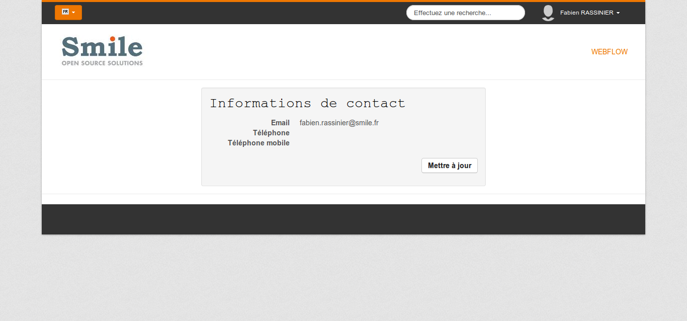
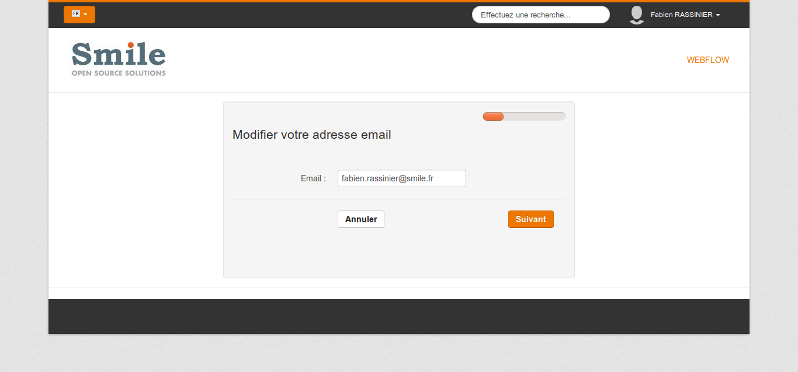
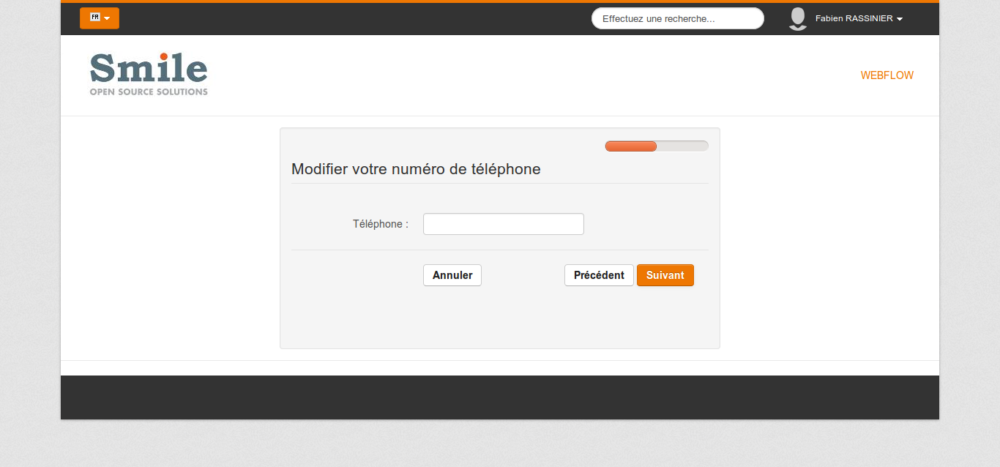
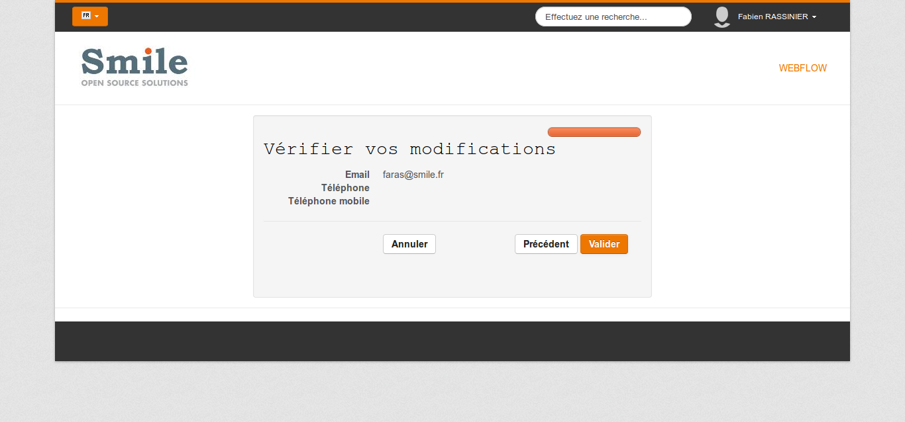
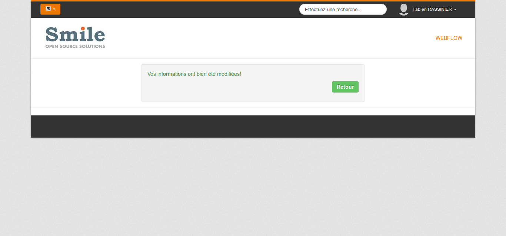
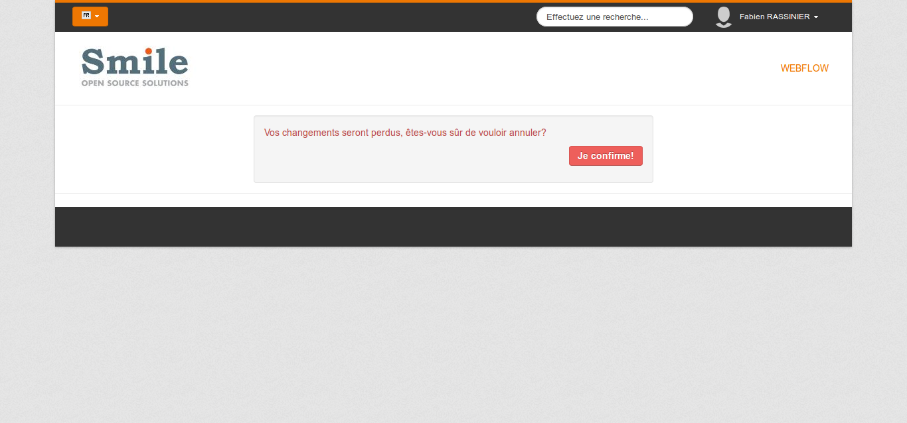

Webflow dans Digital Factory
============================

Table des matières
------------------
* [Introduction](#introduction)
* [Présentation](#présentation)
* [Structure d'un webflow](#structure-dun-webflow)
* [Définition du composant Jahia](#définition-du-composant-jahia)
* [Mise en place de Webflow](#mise-en-place-de-webflow)
* [Modèle](#modèle)
* [Traitements du webflow](#traitements-du-webflow)
* [Vues et transitions](#vues-et-transitions)

* [Validation de formulaire](#validation-de-formulaire)

## Introduction

Les webflows sont des formulaires complexes qui se présentent sur plusieurs étapes s'affichant sur plusieurs pages. 
Webflow n'est pas un nouveau concept mais une solution éprouvée de [Spring](http://projects.spring.io/spring-webflow/).
Sergiy Shyrkov (de Jahia) nous propose une [démo de Webflow](https://github.com/shyrkov/jahia-spring-webflow-showcase) qui fera un très bon complément.
Jahia nous offre aussi la transcription de la [présentation de Sergiy lors de Jahia One 2014](https://www.jahia.com/files/live/sites/jahiacom/files/Resources/docs/7.x/7.1/en/DF7.1_SPRING_WEB_FLOW.pdf).

Cette présentation nécessite une connaissance des concepts Jahia basiques tels que la création de vues et la contribution.
L'objectif est d'apprendre à réaliser des webflows sous Digital Factory de Jahia. 

La grande force de Digital Factory est qu'elle fait partie des CMS où l'on maitrise 100% du code généré, 
nous en profiterons pour produire des formulaires accessibles pendant cette présentation.

## Présentation

Nous prendrons comme exemple une démarche de mise à jour d'informations de contact de l'utilisateur courant sur plusieurs étapes.

### Vue par défaut

  

### Modification de l'adresse email



### Modification de l'adresse email une fois modifiée

  

### Modification du numéro de téléphone fixe



### Modification du numéro de téléphone mobile

  

### Vérification



### Confirmation

  

### Vue par défaut modifiée


### Annulation

A tout moment, dans le processus, il sera possible d'annuler nos modifications.



## Structure d'un webflow

Un webflow fonctionnant sous Digital Factory se définit par plusieurs fichiers.
Il est important de comprendre le rôle de chacun de ces fichiers:

1. applicationContext-webflow.xml : webflow faisant partie de la stack Spring, il nécessite un fichier de contexte où définir des beans
2. flow.xml : ce fichier xml est la définition du webflow, c'est à dire la liste et l'ordre des étapes du webflow ainsi que la définition des beans java utilisés par celui-ci. C'est le cœur de notre webflow.
3. views.jsp : ces fichiers vont contenir les vues utilisées par les différentes étapes de notre webflow. Dans ces vues il y aura le code HTML des différents formulaires.
3. Model.java : cette classe Java définit l'objet correspondant aux informations partagées par les différentes étapes du webflow. Dans notre exemple, il y aura les informations du compte telles que l'adresse email, les numéros de téléphone mobile et fixe.  
4. Handler.java : cette classe Java va contenir les traitements métiers appelés par le webflow. Dans notre exemple c'est cette classe qui va modifier un compte à partir des informations recueillies durant le webflow.

## Définition du composant Jahia

Pour commencer, nous allons déclarer notre composant ainsi que son namespace dans le fichier `definitions.cnd`
Ce fichier est localisé dans le dossier _src/main/resources/META-INF/_.

Nous allons créer deux namespaces dans ce fichier, un premier correspondant aux nodes types et un second correspondant aux mixins.

```jackrabbit
<wfnt = 'http://www.smile.fr/jahia/webflow/nt/1.0'>
<wfmix = 'http://www.smile.fr/jahia/webflow/mix/1.0'>
```

Ensuite, nous allons créer un mixin héritant de `jmix:droppableContent`, cela va nous permettre de créer une entrée de menu et de glisser-déposer notre composant dans une page.

```jackrabbit
[wfmix:webflowContent] > jmix:droppableContent mixin
```

Finalement, nous allons déclarer notre composant. Celui-ci va hériter de la mixin `wfmix:webflowContent` pour pouvoir être glissé-déposé, ainsi que du node type `jnt:content`.

```jackrabbit
[wfnt:form] > jnt:content, wfmix:webflowContent
```
Sauvegardez et compilez. Le composant devrait donc apparaître dans la liste des contenus du mode édition de Jahia.

### Définition de la vue par défaut du composant

Dans le dossier _src/main/resources_, nous allons créer une arboréscence contenant les différentes vues de notre composant.
Tout d’abord il faut créer un dossier correspondant au nom du composant. Le nom de ce dossier se compose de la manière suivante : "namespace du composant" + "_" + "nom du composant en camelCase"
Pour notre exemple, nous allons donc nommer ce dossier `wfnt_form`.
Dans ce dossier nous allons créer un dossier `html`, ce dossier contiendra les vues html.

## Mise en place de Webflow

### Configuration spring
Premièrement la configuration spring. Dans _src/main/resources_ créer _META-INF/spring/applicationContext-webflow.xml_ avec le contenu suivant :

```xml
<?xml version="1.0" encoding="UTF-8"?>
<beans xmlns="http://www.springframework.org/schema/beans"
       xmlns:xsi="http://www.w3.org/2001/XMLSchema-instance"
       xmlns:mvc="http://www.springframework.org/schema/mvc"
       xsi:schemaLocation="http://www.springframework.org/schema/beans
        http://www.springframework.org/schema/beans/spring-beans-3.0.xsd
        http://www.springframework.org/schema/mvc
        http://www.springframework.org/schema/mvc/spring-mvc-3.0.xsd">
    <mvc:annotation-driven conversion-service="springTypeConversionService"/>
    <bean id="messageSource" class="org.jahia.utils.i18n.ModuleMessageSource"/>
</beans>
```

Ces deux beans sont les utilitaires basiques lors de l'utilisation d'un webflow.
`ModuleMessageSource` permet l'utilisation des resource bundles pour l'internationalisation de vos vues.
`SpringTypeConversionService` permet la validation des valeurs renseignées par les utilisateurs au travers de vos formulaires.

Ensuite dans votre dossier de vue, créer un sous-dossier nommé de la manière suivante : nom du composant en camelCase + "." + nom de la vue webflow + ".flow"

Comme nous allons créer une vue par défaut,  le nom de la vue ne doit pas être précisé. L’arborescence devrait donc ressembler à ça _src/main/resources/wfnt\_form/html/form.flow/_.

Ce dossier contiendra d'une part les vues dédiées au webflow et d'autre part sa définition grâce au fichier `flow.xml`.

### Configuration du webflow

Dans le dossier _src/main/resources/wf_form/html/form.flow/_, créez un fichier nommé `flow.xml`.

Voici le code de base du webflow:

```xml
<?xml version="1.0" encoding="UTF-8"?>
    <flow xmlns="http://www.springframework.org/schema/webflow" 
            xmlns:xsi="http://www.w3.org/2001/XMLSchema-instance" 
            xsi:schemaLocation="http://www.springframework.org/schema/webflow 
                                http://www.springframework.org/schema/webflow/spring-webflow-2.0.xsd">
	</flow>
```

Chaque étape du webflow sera à inclure dans la balise `<flow />` par ce code :

```xml
<view-state id="viewName" />
```

La première étape de notre webflow sera la page de présentation des données utilisateur.
Changez la valeur de l'id de la view-state en `display` (c'est ainsi que nous y ferons référence par la suite).


## Modèle
Nous allons créer une couche modele pour manipuler les données durant notre flow.

Créez une nouvelle class Java dans un sous package `*.model` et nommez la `ContactInfo.java` par exemple.
Cette classe doit implémenter la class Serializable pour pouvoir être stockée par spring webflow.

Créez les champs dont vous aurez besoin, il vous faut une variable pour chaque champ présent dans le formulaire.
Générez les getter et setter correspondant ainsi que la méthode `toString()`.

```java
public class ContactInfo implements Serializable {

	private static final long serialVersionUID = 1L;

    private String email;

    private String phone;

    private String mobile;
    ...
    ...
```

Maintenant nous allons instancier et rendre disponible cette classe dans `flow.xml`.

Créez une balise `<var />` contenant un attribut `name` et un attribut `class`. L'attribut `name` va correspondre au nom du bean et l'attribut `class` va correspondre au nom de la classe.


Le code de la balise complète:
```xml
<var name="contactInfo" class="fr.smile.jahia.model.ContactInfo"/>
```

Ce bean sera accessible dans nos formulaires jsp.


## Traitements du webflow

Nous allons créer une classe de traitement chargée d'initialiser les données et mettre à jour l'utilisateur.


Créez une classe Java dans un package `*.handler` et nommez la `ContactInfoHandler`.

Déclarer le bean spring contactInfoHandler dans le fichier applicationContext-webflow.xml
```xml
<?xml version="1.0" encoding="UTF-8"?>
<beans xmlns="http://www.springframework.org/schema/beans"
    ....
    ....
    <bean id="contactInfoHandler" class="fr.smile.jahia.handler.ContactInfoHandler"/>
</beans>

```
Dans cette classe, nous allons créer une méthode `init` pour initialiser le bean contactInfo.
```java
public void init(final ContactInfo contactInfo, final JCRNodeWrapper formNode) throws RepositoryException {
        final JCRUserNode userNode = session.getUserNode();
        contactInfo.setEmail(userNode.getPropertyAsString("j:email"));
        contactInfo.setPhone(userNode.getPropertyAsString("j:phoneNumber"));
        contactInfo.setMobile(userNode.getPropertyAsString("j:mobileNumber"));
}
```

La méthode prend en paramètre l'object ContactInfo déclaré dans le webflow, ainsi que le formNode qui correspond au node courant.

L'objet est initialisé au démarrage du webflow dans une action-state de notre flow.

flow.xml
```xml
    <var name="contactInfo" class="fr.smile.jahia.model.ContactInfo"/>

    <action-state id="init">
        <evaluate
                expression="contactInfoHandler.init(contactInfo, externalContext.nativeRequest.getAttribute('currentResource').node)"/>
        <transition to="display"/>
    </action-state>

    <view-state id="display" model="contactInfo">
    </view-state>
```


## Vues

La première vue présentera un résumé des informations utilisateur et proposera un lien permettant de passer en mode modification.

Pour cette vue par défaut (display.jsp), nous pouvons utiliser ce code pour afficher les informations utilisateur :

```xml
<div class="well span6" style="float:none;margin:0 auto">
    <h2>
        <fmt:message key="wfnt_form.title">
            <fmt:param value="${currentNode.user.name}"/>
        </fmt:message>
    </h2>
    <dl class="dl-horizontal">
        <dt>
            <fmt:message key="wfnt_form.email"/>
        </dt>
        <dd>
            <c:out value="${contactInfo.email}"/>
        </dd>
        <dt>
            <fmt:message key="wfnt_form.phone"/>
        </dt>
        <dd>
            <c:out value="${contactInfo.phone}"/>
        </dd>
        <dt>
            <fmt:message key="wfnt_form.mobile"/>
        </dt>
        <dd>
            <c:out value="${contactInfo.mobile}"/>
        </dd>
    </dl>

    <div class="pull-right">
        <form:form modelAttribute="contactInfo" class="form-horizontal" method="post">
            <button id="next" class="btn btn-primary" type="submit" name="_eventId_next">
                <fmt:message key="wfnt_form.label.update"/>
            </button>
        </form:form>
    </div>
</div>
```


### Tester le flow

Une fois le module déployée dans Jahia, vous pouvez ajouter le composant wfnt:form sur une page.


## Transitions
Le bouton mettre à jour présent sur la première vue déclenche la transition vers la vue suivante :
```xml
  <button id="next" class="btn btn-primary" type="submit" name="_eventId_next">
```

Cette transition est déclarée dans le flow pour la vue display :
```xml
<view-state id="display" model="contactInfo">
        <transition on="next" to="step1" bind="false"/>
</view-state>
```

Il faut faire correspondre le `on` de la transition au name du boutton submit préfixé par `_eventId_`.

Pour la première étape, il s'agira d'afficher un formulaire permettant de modifier l'adresse email de l'utilisateur puis de passer à l'étape suivante.
Pour cela nous créons la vue `step1.jsp` dans le sous-dossier _form.flow/_ :

```xml
<view-state id="step1" model="contactInfo">
    <transition on="next" to="step2"/>
</view-state>
```


```xml
<%@ taglib prefix="c" uri="http://java.sun.com/jsp/jstl/core" %>
<%@ taglib prefix="fmt" uri="http://java.sun.com/jsp/jstl/fmt" %>
<%@ taglib prefix="fn" uri="http://java.sun.com/jsp/jstl/functions" %>
<%@ taglib prefix="form" uri="http://www.springframework.org/tags/form" %>


<div class="well span6" style="float:none;margin:0 auto">
    <div class="clearfix">
        <div class="pull-right">
            Etapes <progress max="4" value="1">(Step 1 of 4)</progress>
        </div>
    </div>

    <form:form modelAttribute="contactInfo" class="form-horizontal" method="post">
        <fieldset>
            <legend><fmt:message key="wfnt_form.step1.title"/></legend>
            <%@ include file="validation.jspf" %>
            <div class="control-group">
                <label class="control-label" for="email">
                    <span class="hide-text">Modifier votre </span><fmt:message key="wfnt_form.email"/> :</label>

                <div class="controls">
                    <form:input path="email" type="email" id="email" name="email" cssErrorClass="error"/>
                </div>
            </div>
            <div class="form-actions">
                <button id="cancel" class="btn" type="submit" name="_eventId_cancel">
                    Annuler
                </button>

                <div class="pull-right">
                    <button id="next" class="btn btn-primary" type="submit" name="_eventId_next">
                        Suivant
                    </button>
                </div>
            </div>
        </fieldset>
    </form:form>
</div>
```

### Transition vers la deuxière étape

Pour la séconde étape du webflow, il s'agira cette fois de modifier le numéro de téléphone de l'utilisateur.
Pour cela nous créons la vue `step2.jsp` dans le sous-dossier _form.flow/_ :

```xml
<%@ taglib prefix="c" uri="http://java.sun.com/jsp/jstl/core" %>
<%@ taglib prefix="fmt" uri="http://java.sun.com/jsp/jstl/fmt" %>
<%@ taglib prefix="fn" uri="http://java.sun.com/jsp/jstl/functions" %>
<%@ taglib prefix="form" uri="http://www.springframework.org/tags/form" %>


<div class="well span6" style="float:none;margin:0 auto">
    <div class="clearfix">
        <div class="pull-right">
            Etapes <progress max="4" value="2">(Step 2 of 4)</progress>
        </div>
    </div>

    <form:form modelAttribute="contactInfo" class="form-horizontal" method="post">
        <fieldset>
            <legend><fmt:message key="wfnt_form.step2.title"/></legend>
            <%@ include file="validation.jspf" %>
            <div class="control-group">
                <label class="control-label" for="phone"><fmt:message key="wfnt_form.phone"/> :</label>

                <div class="controls">
                    <form:input path="phone" type="tel" id="phone" name="phone"/>
                </div>
            </div>
            <div class="form-actions">
                <button id="cancel" class="btn" type="submit" name="_eventId_cancel">
                    Annuler
                </button>

                <div class="pull-right">
                    <button id="previous" class="btn" type="submit" name="_eventId_previous">
                        Pr&eacute;c&eacute;dent
                    </button>
                    <button id="next" class="btn btn-primary" type="submit" name="_eventId_next">
                        Suivant
                    </button>
                </div>
            </div>
        </fieldset>
    </form:form>
</div>
```


### Création des vues et transitions restantes

Nous pouvons finaliser la partie navigation de l'application en ajoutant les vues et transitions manquantes.

Step3 permettra de modifier le numéro de téléphone portable de l'utilisateur et redirigera vers la vue summary.
Summary résumera les modifications soumises par l'utilisateur et sur validation redirigera vers la vue success.
Success affichera un message de succès et proposera un lien renvoyant sur la vue par défaut.

```xml
<view-state id="step2" model="contactInfo">
    <transition on="previous" to="step1"/>
    <transition on="next" to="step3"/>
</view-state>

<view-state id="step3" model="contactInfo">
    <transition on="previous" to="step2" />
    <transition on="next" to="summary" />
</view-state>

<view-state id="summary" model="contactInfo">
    <transition on="previous" to="step3" />
    <transition on="finish" to="success" />
</view-state>

<view-state id="success"/>
```

Il est aussi intéressant de proposer une étape d'annulation disponible à partir de toutes les vues.
On définit une transition globale grâce à la balise `<global-transitions>`.

```xml
<view-state id="cancel"/>

<global-transitions>
    <transition on="cancel" to="cancel" />
</global-transitions>
```


## Traitement mise à jour

Dans notre handler, nous allons ajouter la méthode `update` pour mettre à jour les données saisies par l'utilisateur. Cette méthode va prendre en paramètre l'objet contactInfo.

Il peut également être intéressant de passer les informations du node Jahia courant afin de bénéficier de son contexte.

```java
public void update(final ContactInfo contactInfo, final JCRNodeWrapper formNode)
```

Il faut ensuite lier la méthode `update()` à une de vos transitions. 
Pour ce faire, dans le fichier `flow.xml` et à l'intérieur de la balise `<transition/>` souhaitée, ajoutez une balise `<evaluate />`.
Cette balise doit comporter l'attribut `expression` qui indique le bean et la méthode à appeler.
Ici nous allons modifier la transition finish de la vue summary.

```xml

	<view-state id="summary" model="contactInfo">
	    <transition on="previous" to="step3" bind="false"/>
	    <transition on="finish" to="success" bind="false">
	        <evaluate
	                expression="handler.update(contactInfo, externalContext.nativeRequest.getAttribute('currentResource').node)"/>
	    </transition>
	</view-state>
```

Complétez le corps de la méthode update pour mettre à jour l'utilisateur Jahia courant.


## Validation de formulaire

Webflow permet de mettre en place des mécanismes de validation des champs de formulaire. Cette validation est réalisée en suivant la spécification JSR 303.

Par exemple, pour rendre le champ email requis et devant obligatoirement être au format d'une adresse email, il suffit d'annoter le champ du bean modèle avec 
`org.hibernate.validator.constraints.NotEmpty` et `org.hibernate.validator.constraints.Email`.

ContactInfo.java
```java
@NotEmpty
@Email
private String email;
```

Si une de ces contraintes n'est pas respéctée, l'utilisateur restera sur la même étape et un message d'erreur sera affiché.

Webflow permet une customisation fine de ces message d'erreur. Il suffit d'ajouter au ResourceBundle de l'application une clé de message :
nom du modèle + nom du champ en erreur + type d'erreur

Par exemple :
contactInfo.email.NotEmpty=L'email ne doit pas être vide
contactInfo.email.Email=L'email n'est pas valide

Les deux validateurs proposés proviennent d'Hibernate mais d'autres peuvent être trouvés par exemple dans les packages `javax.validation.constraints.*` et `org.springframework.format.annotation.*`.


## Conclusion

Ce tutoriel nous a permis de découvrir comment intégrer et réaliser une IHM complexe dans Jahia avec spring-webflow.


